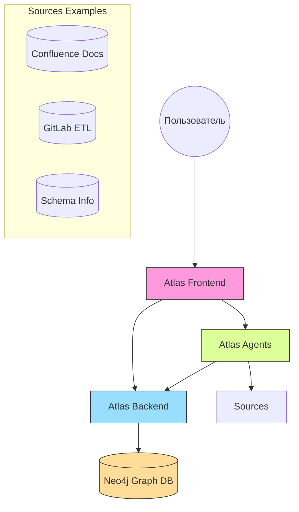
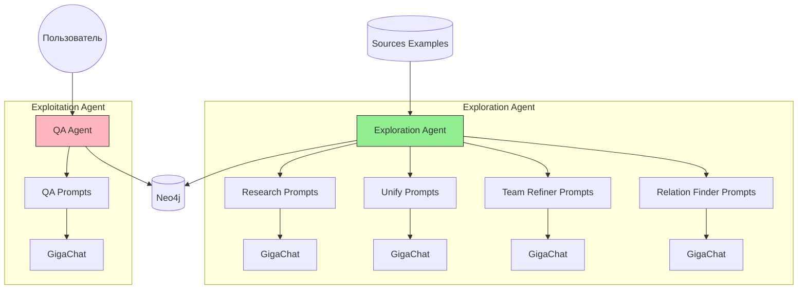
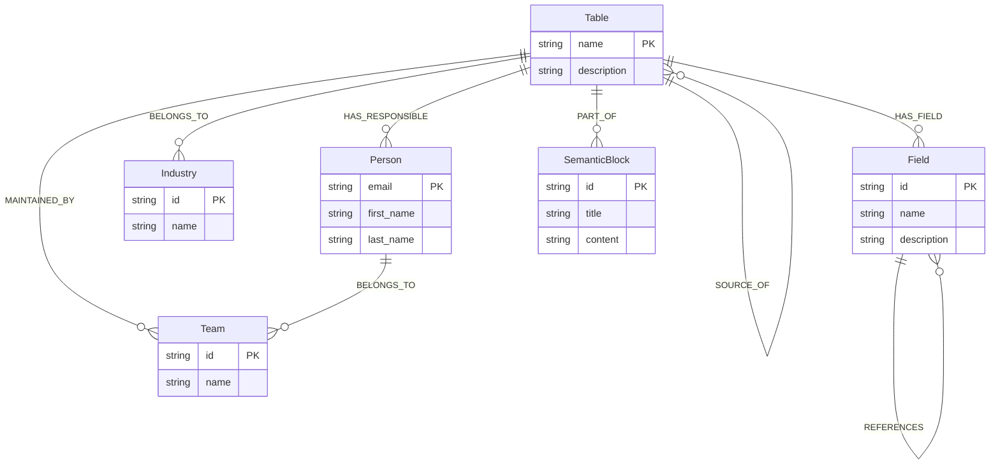

# ATLAS — Guide for Data Voyagers

## Описание проекта

Atlas - это комплексная система для управления знаниями о данных, состоящая из нескольких взаимосвязанных сервисов. Система помогает организациям эффективно управлять метаданными, документировать источники данных и предоставлять удобный интерфейс для работы с информацией о данных.

## Основные компоненты



### 1. Atlas Agents

Сервис интеллектуальных агентов, включающий два специализированных агента:

- **Exploration Agent** - исследует и собирает информацию о таблицах:
  - Анализирует схемы баз данных
  - Извлекает информацию из GitLab и Confluence
  - Создает структурированные описания таблиц
  - Определяет связи между таблицами
  - Уточняет информацию о командах

- **Exploitation Agent** - отвечает на вопросы пользователей:
  - Обрабатывает естественно-языковые запросы
  - Использует GigaChat для генерации ответов
  - Работает с графовой базой данных Neo4j

Схема агентов:


### 2. Atlas Backend

REST API сервис для работы с графовой базой данных Neo4j:

- Управление сущностями (таблицы, поля, команды, индустрии и др.)
- Управление связями между сущностями
- Работа с черновиками описаний таблиц
- Аутентификация пользователей

Схема данных:


### 3. Atlas Frontend

Web-интерфейс для взаимодействия с системой:

- Просмотр и подтверждение черновиков
- Чат с Exploitation Agent для получения информации
- Визуализация графа знаний
- Простая email-аутентификация

### 4. Sources Examples

Мокап-сервис для демонстрации работы с источниками данных:

- Эмуляция Confluence с документацией
- Эмуляция GitLab с ETL-скриптами
- API для поиска информации по таблицам

## Запуск проекта

### Предварительные требования

- Docker и Docker Compose
- Git для клонирования репозитория

### Шаги по запуску

1. Клонировать репозиторий:
```bash
git clone <repository-url>
cd atlas
```

2. Создать и настроить файлы окружения:

```bash
# agents/.env
GIGA_KEY=ваш_ключ_gigachat
NEO4J_PASSWORD=ваш_пароль

# backend/.env
NEO4J_PASSWORD=ваш_пароль
NEO4J_HOST=neo4j
NEO4J_PORT=7687
```

3. Запустить все сервисы через Docker Compose:

```bash
docker-compose up -d
```

После запуска будут доступны следующие сервисы:

- Frontend: http://localhost:3000
- Backend API: http://localhost:8073
- Agents API: http://localhost:8053
- Sources Examples API: http://localhost:8043
- Neo4j Browser: http://localhost:7474

## Основные функции

### Исследование данных

1. Agents сервис автоматически исследует новые таблицы:
```bash
curl -X POST http://localhost:8053/create_drafts
```

2. Созданные черновики появляются в веб-интерфейсе
3. Пользователь просматривает и подтверждает черновики
4. После подтверждения информация сохраняется в графовой базе данных

### Получение информации

1. Пользователь задает вопрос через веб-интерфейс
2. Exploitation Agent обрабатывает вопрос и генерирует ответ на основе данных из Neo4j
3. Пользователь получает структурированный ответ

## Особенности системы

- **Автоматизация**: Автоматический сбор и структурирование информации о данных
- **Интеллектуальная обработка**: Использование LLM для понимания контекста и генерации ответов
- **Графовая база данных**: Эффективное хранение связей между сущностями
- **Современный стек**: React, FastAPI, Neo4j, Docker
- **Масштабируемость**: Микросервисная архитектура позволяет легко масштабировать систему

## Рекомендации по разработке

- Используйте pre-commit hooks для поддержания качества кода
- Следуйте структуре проекта при добавлении новых компонентов
- Документируйте изменения в API и новые функции
- Используйте типизацию в Python и TypeScript
